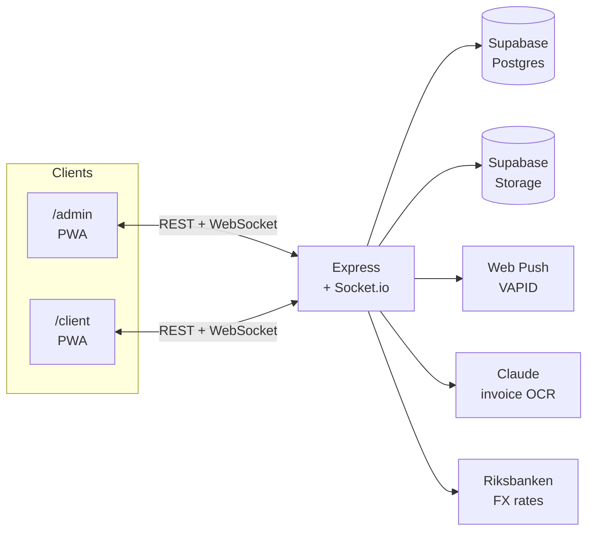

# Vision Palace

A wholesale platform for a luxury eyewear distributor — inventory, sales, invoicing,
customer relationships and Swedish bookkeeping, in one installable web app.

Two apps share one codebase and one realtime backend:

| | Who | Language |
|---|---|---|
| **`/admin`** | The two owners | Swedish |
| **`/client`** | Wholesale buyers | English |

Buyers install it from an invite link, browse what just landed, message the owners
and see their own purchase history. The owners run the whole business from the
other side — stock, sales, invoices, payments and the monthly file their
accountant needs.

Built as a PWA so it installs on a phone home screen with push notifications,
without an app store.

---

## What it does

### For the buyer

- **Feed of new arrivals** — photos, prices, pinned posts, one-tap "interested"
- **Direct chat** with the owners, images included, read receipts and typing indicators
- **Purchases** — every order with monthly totals, outstanding balance, downloadable
  statement, and re-order in one tap
- **Pre-orders** show a live estimate of how long is left before the pair arrives
- **Push notifications** when an order ships or a message comes in

### For the owners

- **Inventory** — one row per physical pair, grouped by model in the UI, so four
  identical frames read as *one card, quantity 4* instead of four duplicates
- **AI invoice import** — photograph a supplier invoice and Claude reads the article
  numbers, quantities and line totals into a reviewable list. Nothing is imported
  without confirmation; a misread reference code would poison the product catalogue
  for years
- **Sales** — multiple pairs per sale, shipping, discounts, walk-in customers who
  aren't in the app, and pre-orders sold before the stock exists
- **Invoicing** — branded PDF invoices generated in the browser
- **Bookkeeping export** — see below
- **Partner settlement** — a derived ledger splitting profit between the two owners

---

## The bookkeeping export

The part with the most rules in it, and the reason for most of the architecture.

Sales are priced in **euro**. Supplier invoices arrive in **kronor**. The books are
kept in **kronor**. Getting that wrong by a few percent every month is invisible
until an audit, so the export follows two separate rules:

- **Sales** are converted at **Riksbanken's official daily rate** for the day the
  sale happened. Weekends and public holidays carry the last published rate forward,
  which is also the accounting convention.
- **Purchases invoiced in kronor are taken at the invoice amount, never converted.**
  Re-deriving them from our euro price would produce a number that doesn't match the
  paper the accountant is holding.

Rates are cached per calendar day, so re-exporting a month produces exactly the
figures already booked, and a month with forty sales costs one API call rather than
forty. If the rate source is unreachable the export still works — but every figure is
flagged and the document says in plain language that it is *not fit for bookkeeping*.
A wrong rate looks exactly like a right one, so silence was the dangerous option.

Two formats from the same data:

- **CSV** for the accounting software — semicolons, decimal commas, UTF-8 BOM, the
  three things Swedish Excel needs to not mangle the file
- **PDF** for humans — paginated properly, with repeated column headers, page numbers
  and a closing stock inventory on its own page

---

## Architecture



**No build step.** Plain ES modules-free JavaScript, served as-is. `git push` is the
entire deployment pipeline. For a two-person business that has to stay running while
being changed, a toolchain that can break independently of the code was a liability,
not an asset.

**Service worker versioning.** `public/sw.js` carries a `CACHE` constant bumped on
every frontend release. Without it, phones keep serving yesterday's JavaScript against
today's API.

**Media is stored twice.** Every upload is resized to a thumbnail at write time.
Feeds and chat load thumbnails; only the lightbox fetches the original. A post with
four phone photos is ~600 kB instead of ~16 MB.

---

## Stack

| Layer | Choice |
|---|---|
| Server | Node.js, Express, Socket.io |
| Database | Supabase (PostgreSQL) |
| Files | Supabase Storage + `sharp` for thumbnails |
| Auth | JWT for owners, session tokens for buyers, `scrypt` password hashing |
| Push | Web Push (VAPID) |
| Frontend | Vanilla JavaScript, no framework, no bundler |
| PDF | `html2pdf` in the browser |
| AI | Anthropic Claude with structured JSON output |
| Hosting | Railway |

---

## Testing

```bash
npm test         # server tests, no browser needed
npm run test:ui  # browser tests — starts the app itself, then shuts it down
```

Two suites, both running against real code rather than mocks of our own logic:

**Server tests** run the real Express routes and the real Supabase client against a
mock PostgREST server. Export arithmetic, currency handling, inventory cleanup and
discount maths are checked end to end.

**Browser tests** drive real Chromium against a real server instance. They assert
things text alone cannot: that PDF pages are exactly A4 and nothing overflows the
paper, that the feed downloads thumbnails rather than originals, that a login screen
survives a browser with storage disabled.

Every test in this repository has been verified to **fail when the bug it covers is
reintroduced**. A test that cannot fail is worse than no test, because it reports
confidence it hasn't earned.

---

## Running it yourself

**Requirements:** Node 18+, a Supabase project.

```bash
npm install
cp .env.example .env      # then fill it in
npm run dev
```

Run the migrations in `supabase/migrations/` in numerical order, in the Supabase SQL
editor. Every one is idempotent and safe to re-run.

Environment variables are documented in [`.env.example`](.env.example). Never commit
the filled-in file — `SUPABASE_SERVICE_KEY` bypasses row-level security entirely.

---

## Project structure

```
server/
  index.js            Express + Socket.io bootstrap
  routes/             one file per domain: sales, inventory, export, orders…
  lib/                auth, uploads, FX rates, Supabase client
public/
  admin.html          owner app
  client.html         buyer app (PWA)
  js/admin/           owner app modules
  js/client/          buyer app modules
  sw.js               service worker — bump CACHE on every release
supabase/migrations/  numbered, idempotent SQL
tests/                server and browser suites
```

---

## License

Proprietary. All rights reserved.
